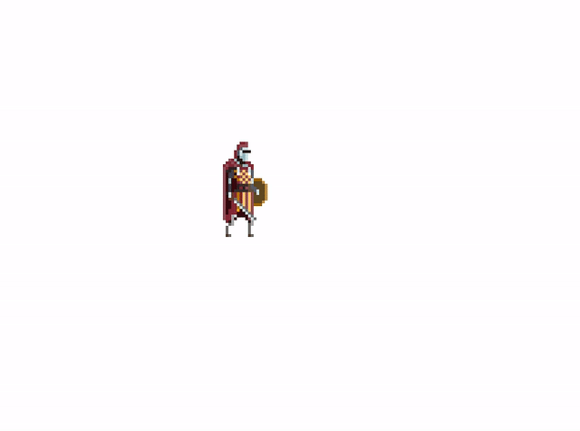
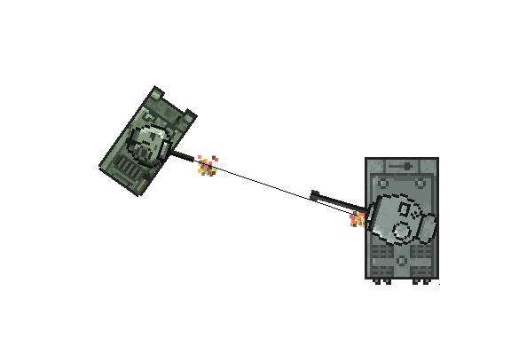

# sdlgl


## An SDL2 Game Library

This is a simple game framework library I'm creating for use in my own games. SDLGL currently provides support for 
* A simple and extensible Entity + Scene organization
* A simple 'Update and Render' game loop with time delta
* Multi-channel audio mixing for sound effects and music
* Easily configurable (JSON-defined) resources supporting:
	* Animated sprites
	* Static textures
	* Sound effects
	* Music tracks
* Collision detection system for rotatable rects
* An FPS counter
* Font renderer
* Direct access to the SDL2 rendering context
* Multiple clean, well commented example programs


## Demo Projects

In addition to the example programs, I have some other projects that are built with SDLGL.

### [SDLGL Knight Game](https://github.com/graysonpike/sdlgl-knight-game)


### [SDLGL Visuals](https://github.com/graysonpike/sdlgl-visuals)


### [SDGL Tank Game](https://github.com/graysonpike/sdlgl-tank-game)



## Installation

To install SDLGL, you will have to build from source using GCC's `g++` compiler.
### Linux

The Makefile currently requires the following packages:

```
sudo apt-get install -y g++ libsdl2-dev libsdl2-image-dev libsdl2-mixer-dev libsdl2-ttf-dev
```

Finally, use the Makefile to build and install the library for development. The `install` rule creates `/usr/local/lib/libsdlgl.a` and copies headers to `/usr/local/lib/sdlgl`.
```
make
make install
```

### MacOS

The Makefile currently requires the following packages:

```
brew install sdl2 sdl2_image sdl2_mixer sdl2_ttf
```

Use the Makefile to build and install the library for development:
```
make
make install
```

## License
SDLGL is licensed under the [MIT License](https://github.com/graysonpike/sdlgl/blob/master/LICENSE).

This library uses the [JSON C++ library by Niels Lohmann](https://github.com/nlohmann/json) which is licensed under the MIT License.